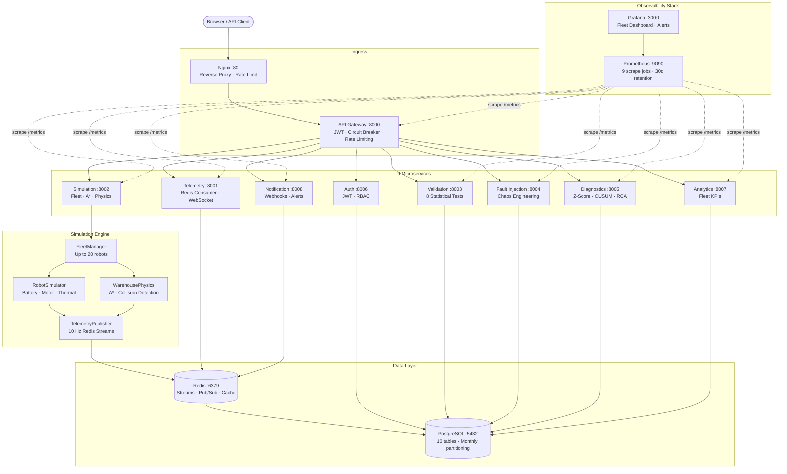
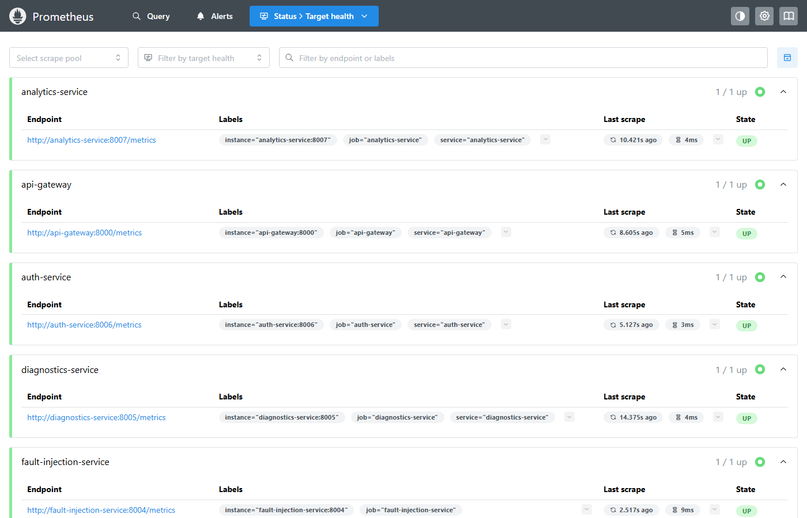
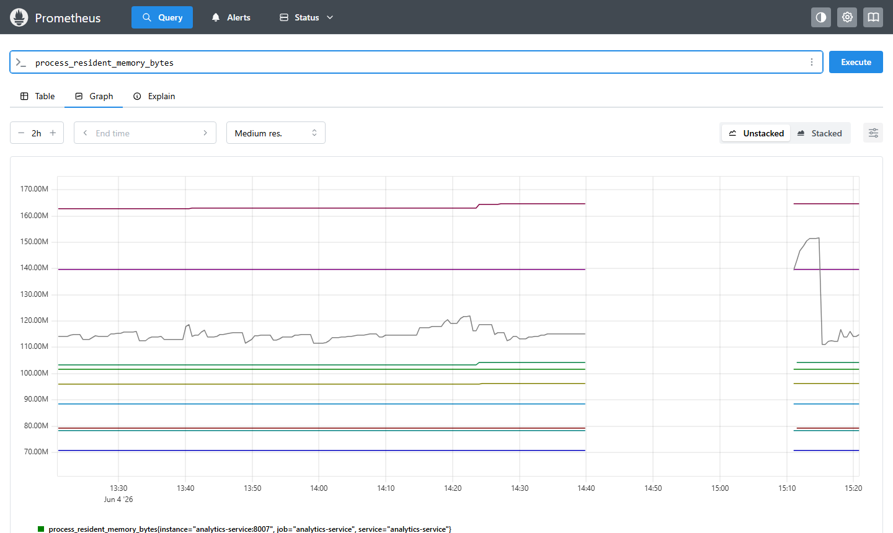
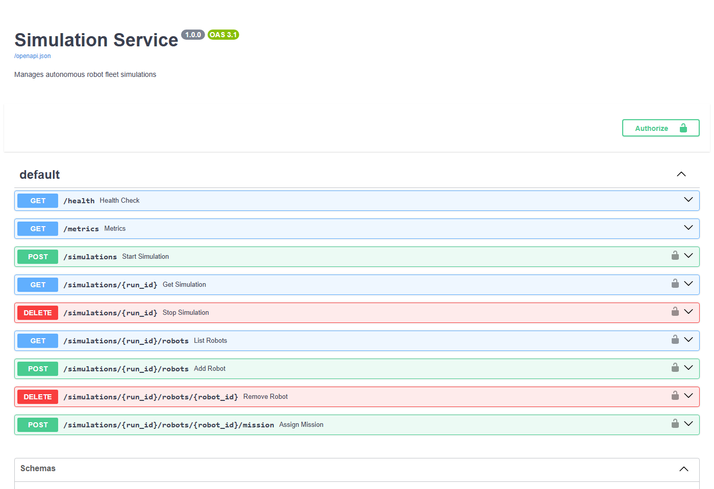
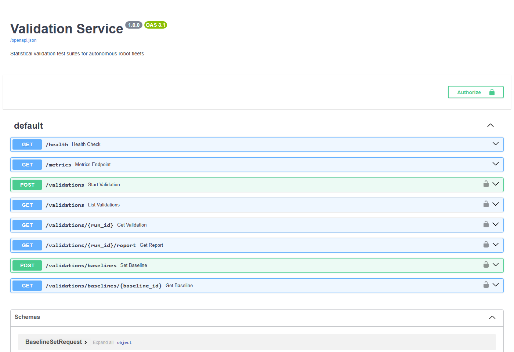
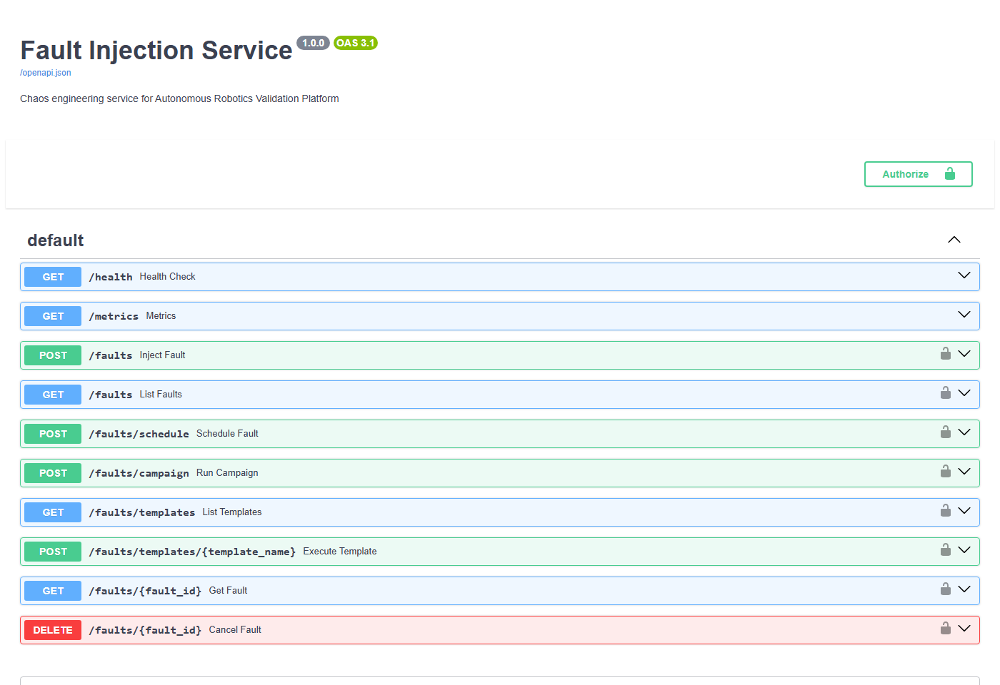
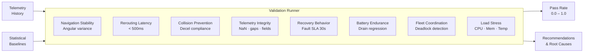
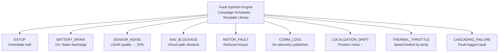

<div align="center">


# Autonomous Robotics Validation Platform

### Test entire robot fleets. No hardware. No datasets. Just chaos.

[](https://python.org)
[](https://fastapi.tiangolo.com)
[](https://docker.com)
[](https://redis.io)
[](https://postgresql.org)
[](https://prometheus.io)
[](https://grafana.com)
[](https://jenkins.io)

[](LICENSE)
[]()
[]()
[]()
[]()

**[Quick Start](#-quick-start) • [Architecture](#-architecture) • [Demo](#-demo-workflow) • [Observability](#-observability) • [Docs](#-services)**

</div>

---

## The Problem

Testing autonomous robot fleets requires:
- Expensive physical hardware ($100k+ per unit)
- Months of setup time
- Real warehouse space
- A team to operate it
- Hoping nothing breaks catastrophically

**ARVP eliminates all of that.**

Spin up a full warehouse fleet simulation in seconds. Inject chaos. Validate behavior statistically. Monitor everything in real time. All from your laptop.

---

## Live Platform

> **Fleet dashboard running with 5 active robots, all 9 services healthy, anomaly detection firing, telemetry at 10 Hz**

<div align="center">


*Real-time Grafana fleet dashboard — Fleet Status · Telemetry Pipeline · API Gateway · Fault Injection · Anomaly Detection · Active Robots gauge · Service Health (all 9 UP) · Validation Activity*

</div>

---

## What's Inside

<table>
<tr>
<td width="50%">

### Simulation Engine
- **50×50 warehouse grid** (25m × 25m, 0.5m/cell)
- **A\* pathfinding** with dynamic obstacle avoidance
- **Realistic physics** — battery drain, motor dynamics, thermal model, LiDAR quality
- **SimPy discrete-event** scheduling for multi-robot coordination
- **Up to 20 robots** running simultaneously at **10 Hz telemetry**

### Chaos Engineering
- **9 fault types**: ESTOP, BATTERY_DRAIN, SENSOR_NOISE, MOTOR_FAULT, NAV_BLOCKAGE, COMM_LOSS, LOCALIZATION_DRIFT, THERMAL_THROTTLE, CASCADING_FAILURE
- **6 scenario templates** — one command fires a full orchestrated incident
- **Campaign scheduling** — multi-step fault chains with delays and dependencies

</td>
<td width="50%">

### Statistical Validation
- **8 automated test suites** powered by NumPy/SciPy
- Pass-rate scoring with configurable thresholds
- Baseline comparison for regression detection

### Anomaly Detection
- **Z-Score** — catches sudden spikes (`|z| > 3σ`)
- **CUSUM** — detects gradual drift before it becomes failure
- **Root Cause Analysis** engine maps anomalies → remediation steps

### Full Observability
- **Prometheus** scrapes all 9 services every 15s
- **Grafana** fleet dashboard — live panels, threshold alerts
- **Structured JSON logging** across every service
- **WebSocket feeds** for real-time telemetry and anomaly alerts

</td>
</tr>
</table>

---

## Architecture



---

## Screenshots

<div align="center">

### Fleet Status — 5 robots · 1 simulation · all services UP


### Prometheus — All 9 services UP



---

### Prometheus — Live metrics across all services



---

### Microservice APIs — FastAPI auto-generated docs

| Simulation Service | Validation Service |
|:---:|:---:|
|  |  |

### Fault Injection — Chaos Engineering API



</div>

---

## Quick Start

> **Prerequisites:** Docker Desktop · ports 80, 3000, 8000–8008, 9090 free

```bash
git clone https://github.com/YOUR_USERNAME/autonomous-robotics-validation-platform.git
cd autonomous-robotics-validation-platform

cp .env.example .env

docker compose up -d

# Wait ~60s for all health checks to pass
docker compose ps
```

| URL | What |
|-----|------|
| `http://localhost:8000/docs` | Swagger API Gateway |
| `http://localhost/grafana` | Grafana Dashboard `admin / admin123` |
| `http://localhost:9090` | Prometheus |
| `http://localhost:8002/docs` | Simulation Service API |
| `http://localhost:8003/docs` | Validation Service API |
| `http://localhost:8004/docs` | Fault Injection API |

> **One-command demo (PowerShell):** `.\demo.ps1`

---

## Demo Workflow

### 1 — Authenticate

```bash
TOKEN=$(curl -s -X POST http://localhost:8000/api/v1/auth/login \
  -H "Content-Type: application/json" \
  -d '{"username":"admin","password":"admin123"}' \
  | python3 -c "import sys,json; print(json.load(sys.stdin)['access_token'])")
```

### 2 — Launch a Fleet Simulation

```bash
curl -X POST http://localhost:8000/api/v1/simulations \
  -H "Authorization: Bearer $TOKEN" \
  -H "Content-Type: application/json" \
  -d '{
    "num_robots": 5,
    "mission_type": "PATROL_ROUTE",
    "fault_injection_enabled": true,
    "fault_probability_per_minute": 0.2,
    "telemetry_rate_hz": 10
  }'
```

```json
{
  "run_id": "5af63434-3b5d-4592-b4a4-8ab4619986b1",
  "status": "running",
  "robot_ids": ["amr-001", "amr-002", "amr-003", "amr-004", "amr-005"]
}
```

### 3 — Inject a Fault

```bash
# Direct fault on one robot
curl -X POST http://localhost:8000/api/v1/faults \
  -H "Authorization: Bearer $TOKEN" \
  -H "Content-Type: application/json" \
  -d '{"robot_id":"amr-002","fault_type":"BATTERY_DRAIN","severity":"HIGH","duration_seconds":120}'

# Or fire a full orchestrated scenario template
curl -X POST "http://localhost:8000/api/v1/faults/templates/sensor_degradation_cascade?robot_id=amr-001" \
  -H "Authorization: Bearer $TOKEN"
```

**Available templates:**

| Template | Scenario |
|----------|----------|
| `warehouse_fire_drill` | Fleet-wide emergency stop |
| `robot_jam` | Navigation blockage with recovery |
| `battery_drain_test` | Systematic battery depletion |
| `sensor_degradation_cascade` | Multi-sensor failure chain |
| `fleet_stress_test` | All robots pushed to limits simultaneously |
| `network_chaos` | Communication loss and reconnect |

### 4 — Run Automated Validation

```bash
curl -X POST http://localhost:8000/api/v1/validations \
  -H "Authorization: Bearer $TOKEN" \
  -H "Content-Type: application/json" \
  -d '{
    "robot_id": "amr-001",
    "test_suite": ["NAVIGATION_STABILITY","TELEMETRY_INTEGRITY","BATTERY_ENDURANCE","RECOVERY_BEHAVIOR"],
    "pass_threshold": 0.75
  }'
```

```json
{
  "run_id": "6dec6fac-...",
  "status": "COMPLETED",
  "pass_rate": 0.75,
  "overall_passed": true,
  "results": [
    {"test_name": "NAVIGATION_STABILITY", "passed": true,  "score": 0.9999},
    {"test_name": "TELEMETRY_INTEGRITY",  "passed": true,  "score": 1.0},
    {"test_name": "BATTERY_ENDURANCE",    "passed": false, "score": 0.6},
    {"test_name": "RECOVERY_BEHAVIOR",    "passed": true,  "score": 0.85}
  ]
}
```

### 5 — Subscribe to Live Data via WebSocket

```javascript
// Real-time telemetry stream
const telemetry = new WebSocket("ws://localhost:8000/ws/telemetry/amr-001");
telemetry.onmessage = (e) => {
  const { battery_level, x, y, velocity_mps, motor_state } = JSON.parse(e.data);
  console.log(`Battery: ${battery_level}% | Pos: (${x}, ${y}) | Speed: ${velocity_mps} m/s`);
};

// Live anomaly alerts with RCA
const alerts = new WebSocket("ws://localhost:8000/ws/diagnostics/amr-001");
alerts.onmessage = (e) => {
  const { metric, z_score, algorithm, root_cause, recommendation } = JSON.parse(e.data);
  console.log(`ANOMALY [${algorithm}] ${metric} z=${z_score} → ${recommendation}`);
};
```

---

## Validation Test Suites



| Test | Measures | Pass Condition |
|------|----------|----------------|
| **NAVIGATION_STABILITY** | Angular velocity variance + position smoothness | Variance below threshold |
| **REROUTING** | Time to reroute after obstacle injection | < 500 ms |
| **COLLISION_PREVENTION** | Deceleration near obstacles | Decel > 0.3 m/s² |
| **TELEMETRY_INTEGRITY** | NaN rate, field completeness, timestamp gaps | < 5% NaN, gaps < 500 ms |
| **RECOVERY_BEHAVIOR** | Time from fault to operational state | Recovery < 30 s (SLA) |
| **BATTERY_ENDURANCE** | Drain rate regression, anomalous spikes | Stable drain rate |
| **FLEET_COORDINATION** | Grid collisions, deadlock detection | Zero collisions or deadlocks |
| **LOAD_STRESS** | CPU, memory, temperature, API latency | CPU < 80%, Temp < 75°C |

---

## Fault Injection



Faults can be chained into **campaigns** — multi-step orchestrated scenarios with delays and conditional triggers. This mirrors how real systems fail in production: one component stresses another until something breaks.

---

## Observability

### Prometheus Targets — All 9 services scraped every 15s

<div align="center">

</div>

### Grafana Fleet Dashboard panels

| Panel | Metric | What it shows |
|-------|--------|---------------|
| Fleet Status | `active_robots_total` · `active_simulations` · `active_faults_gauge` | Live fleet state |
| Telemetry Pipeline | `telemetry_packets_published_total` · `samples_ingested/persisted` | Data pipeline throughput |
| API Gateway | `gateway_requests_total` by status | Request rate and error rate |
| Fault Injection | `active_faults_gauge` · `faults_injected_total` | Chaos activity |
| Anomaly Detection | `diagnostics_anomalies_detected_total` · `diagnostics_alerts_active` | Z-Score + CUSUM firing |
| Active Robots | `active_robots_total` | Gauge (max 20) |
| Service Health | `up{job="..."}` × 9 | Green/red per service |
| Validation Activity | `validation_runs_completed_total` · `validation_active_runs` | Test run history |

**Alert rules** fire when:
- Battery < 10% critical threshold
- Simulation failure rate > 5%
- API latency > 1s (p95)
- Anomaly detection rate spikes

---

## Services

| Service | Port | Responsibility |
|---------|------|----------------|
| **API Gateway** | 8000 | JWT auth, sliding-window rate limiting, circuit breaker, Swagger |
| **Auth** | 8006 | Login, JWT issuance/refresh, RBAC (ADMIN / OPERATOR / VIEWER) |
| **Simulation** | 8002 | FleetManager, A\* pathfinding, warehouse physics, robot spawning |
| **Telemetry** | 8001 | Redis Streams consumer, PostgreSQL writer, WebSocket broadcaster |
| **Validation** | 8003 | 8 statistical test suites, baseline regression, pass-rate scoring |
| **Fault Injection** | 8004 | 9 fault types, 6 scenario templates, campaign scheduling |
| **Diagnostics** | 8005 | Z-Score + CUSUM anomaly detection, RCA engine, fleet health score |
| **Analytics** | 8007 | Fleet KPI aggregation — uptime, MTTR, battery trends |
| **Notification** | 8008 | Redis pub/sub consumer, webhook delivery (Slack/PagerDuty), WS alerts |
| Prometheus | 9090 | Metrics aggregation — 9 scrape jobs, 30-day retention |
| Grafana | 3000 | Pre-provisioned fleet dashboard, alert rules |
| PostgreSQL | 5432 | 10-table schema, telemetry partitioned by month, BRIN indexes |
| Redis | 6379 | Telemetry streams, pub/sub, rate-limit counters, sorted-set analytics |
| Nginx | 80 | Reverse proxy, WebSocket upgrade, gzip |

---

## Tech Stack

| Layer | Technology | Why |
|-------|-----------|-----|
| Language | Python 3.11 | Async-native, rich scientific ecosystem |
| API Framework | FastAPI + Uvicorn | Auto-generated docs, async/ASGI, Pydantic validation |
| Simulation | SimPy + NumPy + SciPy | Discrete-event scheduling + physics math |
| Database | PostgreSQL 15 + asyncpg | Time-series with monthly partitioning, BRIN indexes |
| Streaming | Redis 7 Streams | Low-latency ordered telemetry at 10 Hz |
| Cache / Pub-Sub | Redis (Sorted Sets, Pub/Sub) | Rate limiting, analytics, alert fanout |
| Auth | JWT (python-jose) + bcrypt | Stateless tokens, role-based access |
| Observability | Prometheus + Grafana | Pull-based metrics, pre-built dashboards |
| Logging | structlog (JSON) | Machine-readable, easy to ingest into ELK/Loki |
| Containers | Docker + Docker Compose | 14-container stack, one command to launch |
| CI/CD | Jenkins (Jenkinsfile) | 6-stage pipeline: lint → test → build → smoke → observe |
| Patterns | Microservices, Circuit Breaker, Event-Driven, CQRS | Production-grade resilience |

---

## Database Schema

```
robots              — Robot registry (UUID, status, fleet_id, capabilities)
telemetry_events    — ⚡ PARTITIONED BY MONTH · BRIN indexed (append-only TS)
simulation_runs     — Run metadata (status, world, robot count, duration)
faults              — Injected faults with cascading relationships
validation_runs     — Test suite results (pass rate, recommendations, regression)
anomalies           — Z-Score / CUSUM detections with scores and RCA
users               — Accounts with bcrypt-hashed passwords and RBAC roles
api_keys            — Programmatic access tokens
audit_log           — Immutable security audit trail
notifications       — Alert delivery history and webhook status
```

`telemetry_events` is range-partitioned by month — time-range queries only scan relevant partitions. BRIN (Block Range INdex) keeps index overhead near-zero for append-only writes.

---

## Warehouse Simulation

```
  SMALL WAREHOUSE — 50×50 grid  (25m × 25m, 0.5m/cell)
  ┌────────────────────────────────────────────────────┐
  │  [C] [C]  ·   ·   ·   ·   ·   ·   ·   ·   ·  [C] │  C = Charging Station
  │   ·   ·   ·  [S][S][S]  ·  [S][S][S]  ·   ·   ·  │  S = Shelf / Wall
  │   ·   ·   ·  [S][S][S]  ·  [S][S][S]  ·   ·   ·  │  P = Pickup Zone
  │   ·   ·   ·   ·   ·   ·   ·   ·   ·   ·   ·   ·  │  D = Dropoff Zone
  │  [P][P][P]  ·   ·   ·   ·   ·   ·  [D][D][D]  ·  │  Z = Congestion Zone
  │  [P][P][P]  ·  [S][S][S]  ·  [S][S][S]  ·  [D]   │
  │   ·   ·   ·   ·   ·   ·   ·   ·   ·   ·   ·   ·  │  Robots navigate via
  │   ·  [Z][Z][Z]  ·   ·   ·  [Z][Z][Z]  ·   ·   ·  │  A* pathfinding with
  │   ·  [Z][Z][Z]  ·   ·   ·  [Z][Z][Z]  ·   ·   ·  │  Manhattan heuristic
  │   ·   ·   ·   ·   ·   ·   ·   ·   ·   ·   ·   ·  │  + collision avoidance
  │  [C]  ·   ·  [S][S][S]  ·  [S][S][S]  ·   ·  [C] │
  └────────────────────────────────────────────────────┘
```

**Robot physics model:**
- Battery: base idle discharge + motion-proportional drain
- Thermal: CPU temperature with ~2 min time constant, speed throttle above threshold
- Motor: wheel RPM, torque, acceleration/deceleration curves
- LiDAR: quality metric degraded by SENSOR_NOISE fault type

---

## Project Structure

```
autonomous-robotics-validation-platform/
├── services/
│   ├── api-gateway/           # JWT · rate limiting · circuit breaker
│   ├── auth-service/          # Login · JWT · RBAC
│   ├── simulation-service/    # Fleet manager · A* · physics engine
│   ├── telemetry-service/     # Redis Streams consumer · WebSocket
│   ├── validation-service/    # 8-suite statistical validation
│   ├── fault-injection-service/   # Chaos engineering · campaign scheduler
│   ├── diagnostics-service/   # Z-Score · CUSUM · RCA
│   ├── analytics-service/     # Fleet KPI aggregation
│   └── notification-service/  # Webhooks · WebSocket alerts
├── robotics/
│   ├── synthetic_simulator/   # RobotSimulator · FleetManager · TelemetryPublisher
│   └── warehouse_maps/        # 50×50 grid warehouse definition
├── infrastructure/
│   ├── postgres/init.sql      # 10-table schema with partitioning
│   ├── redis/redis.conf
│   ├── prometheus/            # Scrape config · alert rules
│   ├── grafana/               # Pre-provisioned dashboard JSON · datasource
│   └── nginx/nginx.conf
├── tests/                     # Unit · integration · stress · telemetry
├── docs/screenshots/          # Platform screenshots
├── docker-compose.yml         # Full 14-container stack
├── Jenkinsfile                # 6-stage CI/CD pipeline
├── demo.ps1                   # One-command end-to-end showcase
└── .env.example
```

---

## Running Tests

```bash
# Unit tests — no Docker required
pip install -r tests/requirements-test.txt
pytest tests/test_simulator.py tests/test_validation.py -v

# Integration tests — requires docker compose up
pytest tests/ -m integration -v

# Stress tests
pytest tests/stress/ -v
```

---

## CI/CD Pipeline

```
┌─────────────────────────────────────────────────────────────┐
│  Push → GitHub → Jenkins Webhook                            │
│                                                             │
│  Stage 1: Lint (ruff) + docker-compose config validate      │
│  Stage 2: Unit tests (pytest, no Docker)                    │
│  Stage 3: ┌──────────────┐  Parallel image builds          │
│           │ Build all 9  │  (simulation, telemetry,         │
│           │ Docker images│   validation, fault-injection...) │
│           └──────────────┘                                  │
│  Stage 4: Integration smoke tests (compose up + API probes) │
│  Stage 5: Observability checks (Prometheus healthy, Grafana) │
└─────────────────────────────────────────────────────────────┘
```

---

## Default Credentials

| Service | Username | Password |
|---------|----------|----------|
| API (admin) | `admin` | `admin123` |
| Grafana | `admin` | `admin123` |

> Change `JWT_SECRET`, `POSTGRES_PASSWORD`, and `GF_SECURITY_ADMIN_PASSWORD` in `.env` before any non-local deployment.

---

## Roles

| Role | Access |
|------|--------|
| `ADMIN` | Full access to all endpoints |
| `OPERATOR` | Simulation, validation, fault injection, analytics |
| `VIEWER` | Read-only — fleet overview, telemetry history |

---

<div align="center">

Built to demonstrate production-grade backend architecture applied to autonomous systems.

**9 microservices · 14 containers · 10 Hz telemetry · 8 validation tests · 9 fault types · real-time anomaly detection**

[](https://github.com/YOUR_USERNAME/autonomous-robotics-validation-platform)

</div>
